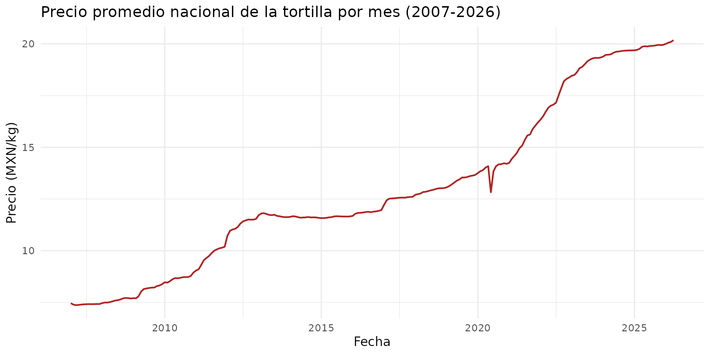
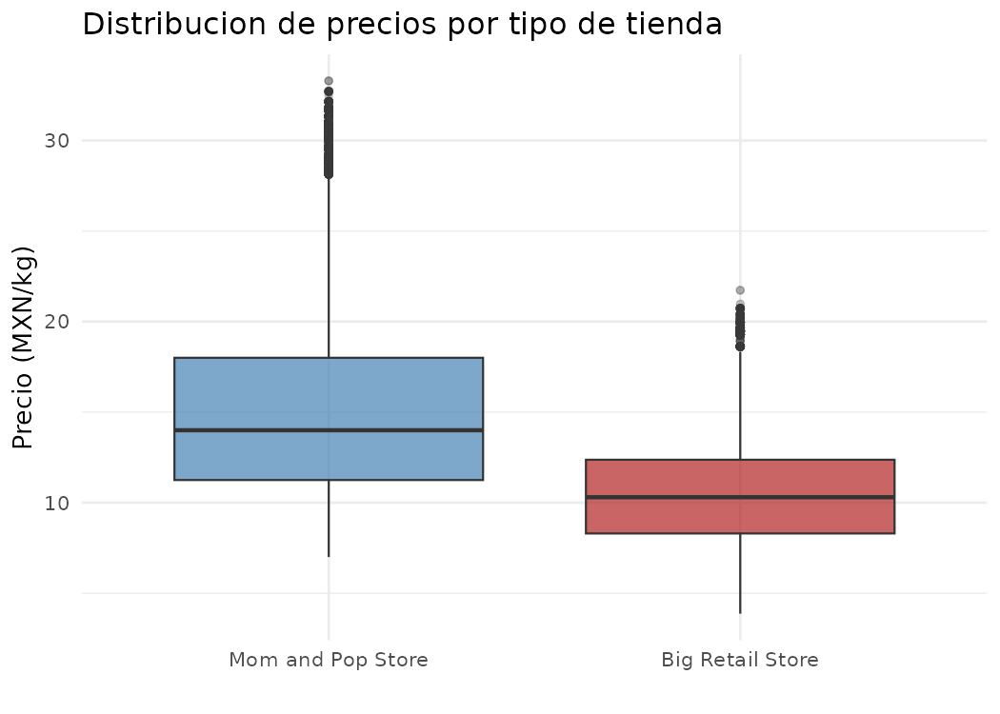
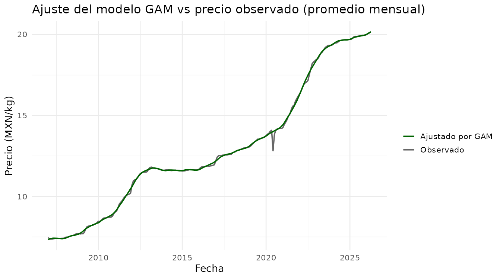
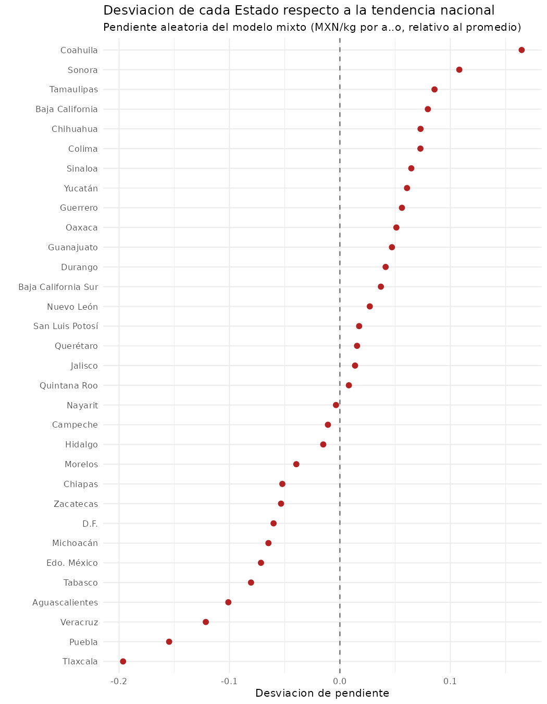
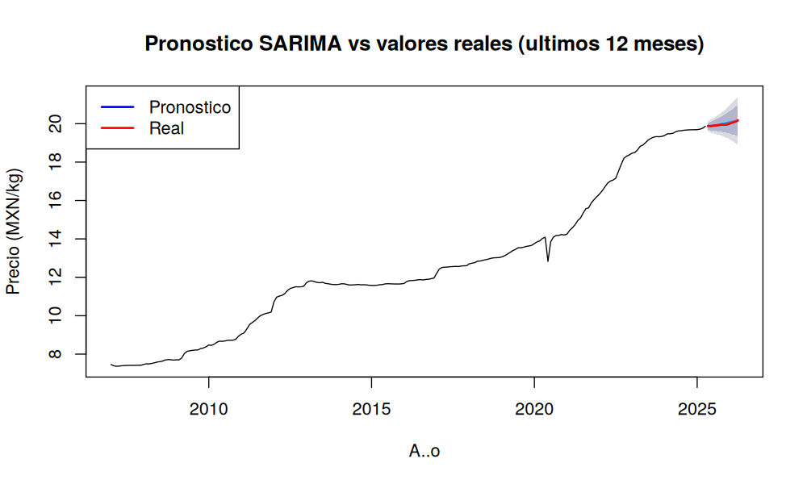
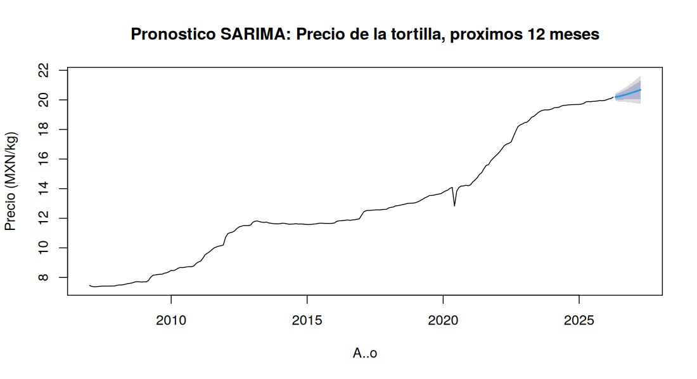

# 🌮 Precio de la tortilla en México: tendencia, diferencias regionales y pronóstico (2007–2026)
### R · 306,655 registros · 32 estados · regresión, GAM, CART, modelos mixtos y SARIMA

**Resultado principal:** el precio de la tortilla pasó de ~$7.5 a **$20.2 MXN/kg** entre 2007 y 2026. Una tortillería de barrio cobra en promedio **$5.2 más por kilo** que un supermercado, y el pronóstico SARIMA, validado con los últimos 12 meses reales, tiene un error de solo **0.17% (MAPE)**, alrededor de 3 veces menor que un pronóstico ingenuo que repite el último valor.

---

## 🎯 Problema
La tortilla es el alimento básico con mayor peso en el gasto de los hogares mexicanos. Este análisis responde tres preguntas:
1. ¿Cómo ha evolucionado su precio desde 2007?
2. ¿Qué tanto cambia según el tipo de tienda y el estado?
3. ¿Se puede pronosticar su precio a 12 meses?

## 📁 Datos
- **Fuente:** [Tortilla Prices in Mexico](https://www.kaggle.com/datasets/richave/tortilla-prices-in-mexico) (Kaggle), con datos del Sistema Nacional de Información e Integración de Mercados (SNIIM).
- **313,230 registros** de precio por kilogramo por fecha, estado, ciudad y tipo de tienda (tortillería de barrio o supermercado), de enero de 2007 a 2026.

## 🧹 Limpieza
| Problema | Registros | Decisión |
|---|---|---|
| Espacios Unicode ocultos en nombres de estados y ciudades | — | Corregidos |
| Precio faltante | 6,574 (2.1%) | Eliminados |
| Precio igual a $0 (Irapuato, 2009) | 1 | Eliminado: error de captura |

**Resultado:** 306,655 registros válidos (97.9% del total).

La regla de Tukey (1.5×IQR) marcaba 22,750 precios como atípicos, pero eran precios legítimos de 2022–2026 por la inflación. Con una **regresión robusta (Huber)** condicionada al tiempo, las anomalías reales se redujeron a **3,117**, y el 38% está en Sonora.

## 📈 Resultados
| Análisis | Resultado |
|---|---|
| Precio promedio: tortillería de barrio vs. supermercado | **$15.5 vs. $10.3 MXN/kg** |
| Regresión lineal simple (precio ~ tiempo) | R² = 0.535; el precio sube ~$0.68 por año |
| Regresión múltiple (tiempo + tipo de tienda + mes) | **R² = 0.790** |
| GAM (tendencia no lineal + estacionalidad cíclica) | **R² ajustado = 0.824** |
| Árbol de regresión CART | **R² = 0.937**; variables más importantes: tiempo, tipo de tienda y estado |
| Logit: ¿el precio distingue una tortillería de un supermercado? | **91.4% de exactitud** en datos de prueba (partición 80/20) |
| Modelo mixto: varianza explicada por el estado (ICC) | **18.4%** |
| Estados más caros / más baratos | Sonora, Baja California, Coahuila / Tlaxcala, Puebla |
| Estados donde el precio sube más rápido / más lento | Coahuila, Sonora, Tamaulipas / Tlaxcala, Puebla, Veracruz |
| **Pronóstico SARIMA (12 meses fuera de muestra)** | **MAE = $0.034 · RMSE = $0.042 · MAPE = 0.17%** (Ljung-Box p = 0.998) |
| Pronóstico mayo 2026 – abril 2027 | De $20.19 a **$20.67 MXN/kg** |

## 🔍 Hallazgos
1. **Tres etapas del precio:** subida sostenida (2007–2012), estabilidad (2013–2020) y fuerte aceleración (2021–2026).
2. **El tipo de tienda pesa más que el estado:** comprar en supermercado ahorra ~$5.2 por kilo, mientras que el estado explica el 18% de la variación.
3. **El norte se encarece más rápido:** los estados fronterizos tienen los precios más altos y la mayor velocidad de aumento.
4. **La estacionalidad es mínima:** el efecto del mes es de apenas ±$0.04, así que el precio lo mueve la tendencia, no la temporada.

## ⚠️ Limitaciones
- El MAPE tan bajo se explica porque la serie es un promedio nacional mensual de miles de registros, que es muy estable en el corto plazo. Por eso se comparó contra un pronóstico ingenuo (repetir el último valor), y SARIMA lo supera claramente.
- El árbol CART y el modelo mixto se evaluaron con los mismos datos de entrenamiento.

## 🛠️ Herramientas
R: dplyr, ggplot2, lubridate, MASS, mgcv, rpart, lme4, forecast, tseries

## ▶️ Cómo reproducirlo
1. Descarga `tortilla_prices.csv` desde Kaggle.
2. En Google Colab: *Entorno de ejecución → Cambiar tipo → R*, sube el CSV y ejecuta `analisis_precio_tortilla.R`.
3. Las gráficas se guardan en la carpeta `output/`.

---
Proyecto del Diplomado en Ciencia de Datos, Facultad de Química, UNAM (2026).
**Autor:** Miguel Ángel Guillén Hernández · [LinkedIn](https://linkedin.com/in/miguel-angel-guillen-hernandez) · [GitHub](https://github.com/317267974)
